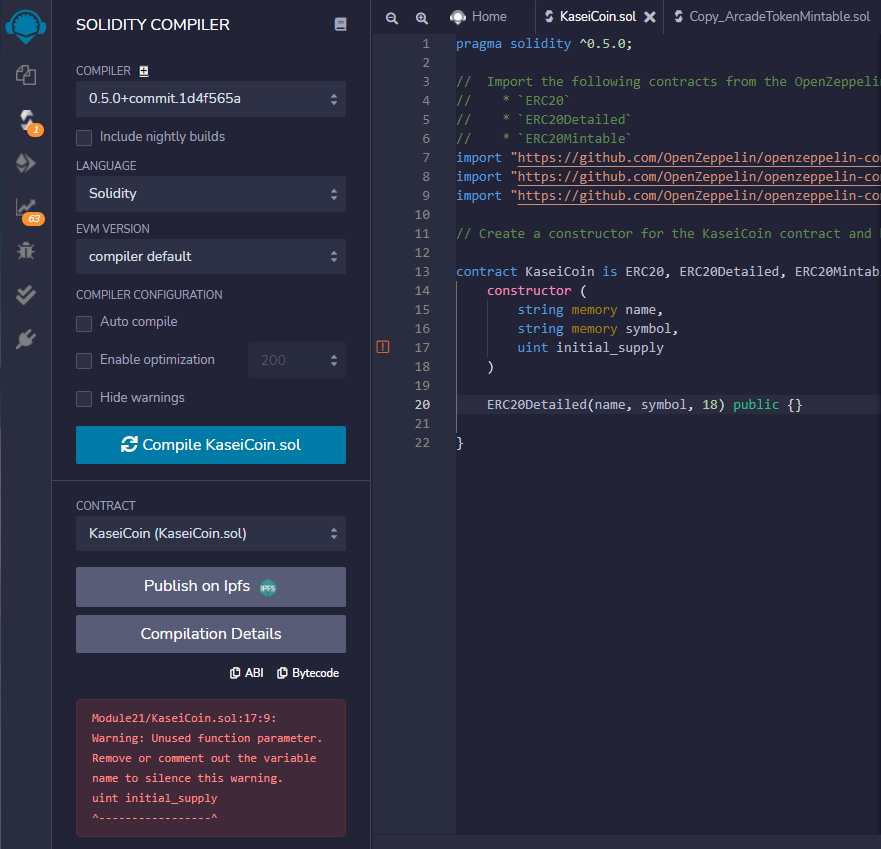
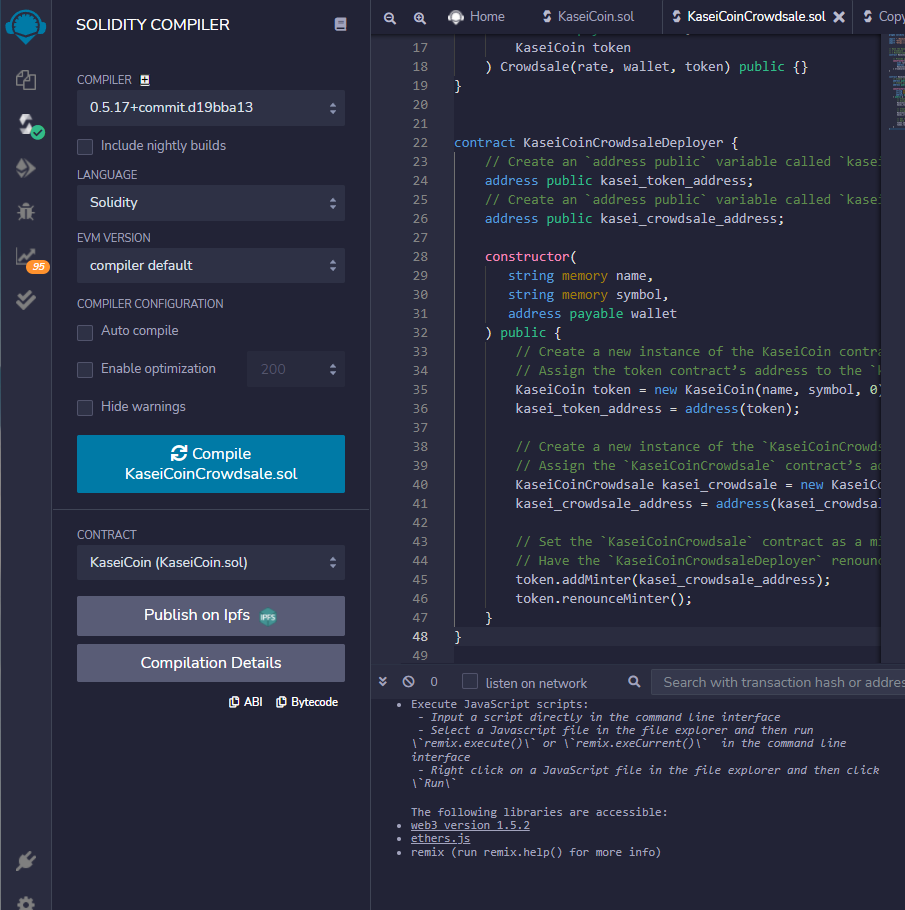

# 21: Solidity Tokenomics - ERC-20, OpenZeppelin, & Crowdsales
FinTech Bootcamp Module 21 Challenge

---

As the first human colony-to-be on Mars, we at Martian Aerospace Agency have developed a monetary system for the new Mars colony. This new monetary system is based on blockchain technology, and is known as KaseiCoin (“Kasei” means “Mars” in Japanese). KaseiCoin will be a fungible token that is ERC-20 compliant. Included is a crowdsale that will allow people who are moving to Mars to convert their earthling money to KaseiCoin. The contract will mint the KAI tokens automatically and distribute them to buyers in one transaction.

---

## Technologies

This smart contract was written on a Windows 10 machine in the Solidity language. It is compileable in versions 0.5.5 and above, as indicated in the first line of executable code:
```
pragma solidity ^0.5.5;
```

OpenZeppelin's *ERC20, ERC20Detailed,* and *ERC20Mintable* libraries were imported to the *KaseiCoin.sol* file. *Crowdsale* and *MintedCrowdsale* were imported to the *KaseiCoinCrowdsale.sol* file.
```
KaseiCoin.sol

import "https://github.com/OpenZeppelin/openzeppelin-contracts/blob/release-v2.5.0/contracts/token/ERC20/ERC20.sol";
import "https://github.com/OpenZeppelin/openzeppelin-contracts/blob/release-v2.5.0/contracts/token/ERC20/ERC20Detailed.sol";
import "https://github.com/OpenZeppelin/openzeppelin-contracts/blob/release-v2.5.0/contracts/token/ERC20/ERC20Mintable.sol";

KaseiCoinCrowdsale.sol

import "https://github.com/OpenZeppelin/openzeppelin-contracts/blob/release-v2.5.0/contracts/crowdsale/Crowdsale.sol";
import "https://github.com/OpenZeppelin/openzeppelin-contracts/blob/release-v2.5.0/contracts/crowdsale/emission/MintedCrowdsale.sol";
```

* [OpenZeppelin](https://docs.openzeppelin.com/) provides a complete suite of security products to build, manage, and inspect all aspects of software development and operations for Ethereum projects. OpenZeppelin security audits are trusted by leading organizations building decentralized systems. Guides and examples are provided to integrate OpenZeppelin security products to all aspects of Ethereum development and operations.

The mock local blockchain that this contract runs on is Ganache. The addresses used are from its list of local mock wallets.

* [Ganache](https://trufflesuite.com/docs/ganache/index.html) is a personal blockchain for rapid Ethereum and Corda distributed application development. You can use Ganache across the entire development cycle; enabling you to develop, deploy, and test your dApps in a safe and deterministic environment. In this case, it was used to generate Ethereum-connected mock accounts with which to mimic transactions. All versions of Ganache are available for Windows, Mac, and Linux.

The contract's contents were developed in the online Remix IDE for its contained deployment and testing features.

* [Remix IDE](https://remix-ide.readthedocs.io/en/latest/) is an open source web and desktop application. It fosters a fast development cycle and has a rich set of plugins with intuitive GUIs. Remix is used for the entire journey of contract development as well as act as a playground for learning and teaching Ethereum.

The selected environment for deployment is the JavaScript VM (London).

* [JavaScript VM](https://vide-old.readthedocs.io/en/latest/quickstart_javascript_vm.html) is one of the 3 environments Remix can be plugged to. The JavaScript VM mode is convenient because each execution runs in your browser. Thus reloading the page will restart Remix with an empty state. The other two options, *Injected provider* and *Web3 provider*, both require the use of an external tool. (The external tool for *Web3 provider* is an Ethereum node, the tools for *Injected provider* are Mist or Metamask.)

---

## Deployed contract with hashed verification

KaseiCoin compiled



KaseiCoinCrowdsale compiled



---

## Contributors

Brought to you by lead developer Erin Kenny at Martian Aerospace Agency.

[Email](ekenny3@uncc.edu)

[LinkedIn](www.linkedin.com/in/e-kenny)

---

## License

MIT

License file included in repository.
